# Lieflat HTML Design

An HTML visual design skill collection for agents, organized by delivery surface: horizontal HTML decks, Xiaohongshu longform article cards, and Xiaohongshu cover cards.

This repository packages a curated set of single-file HTML visual systems into reusable Agent Skills. Codex, Claude Code, Moxt, and other agent workspaces can read each skill's catalog and style-understanding references to choose the right delivery surface, select a visual direction, adapt copy and structure, and verify outputs with browser screenshots.

Chinese version: [README.md](./README.md).

## What Is Included

- 4 installable skills: router, HTML deck, Xiaohongshu longform, and Xiaohongshu cover
- `lieflat-html-deck`: 12 presentation style families, each with Chinese and English variants
- `lieflat-xhs-longform`: 11 Chinese-first Xiaohongshu longform templates exported as `3:5` vertical PNG cards
- `lieflat-xhs-cover`: 11 Chinese-first Xiaohongshu cover templates exported as `3:4` first-image PNG cards
- Each production skill has its own `assets/catalog.json`, templates, style-understanding reference, and screenshot scripts

## Presentation Template Gallery

The pack is intentionally broad: it covers creator identity systems, technical analysis, consulting reports, quiet editorial design, premium brand campaigns, serious reviews, and image-led portfolios.

GitHub README files render repository-relative image paths directly. The previews below come from `previews/en/*.png`.

### Technical / Systems

<table>
  <tr>
    <td width="50%">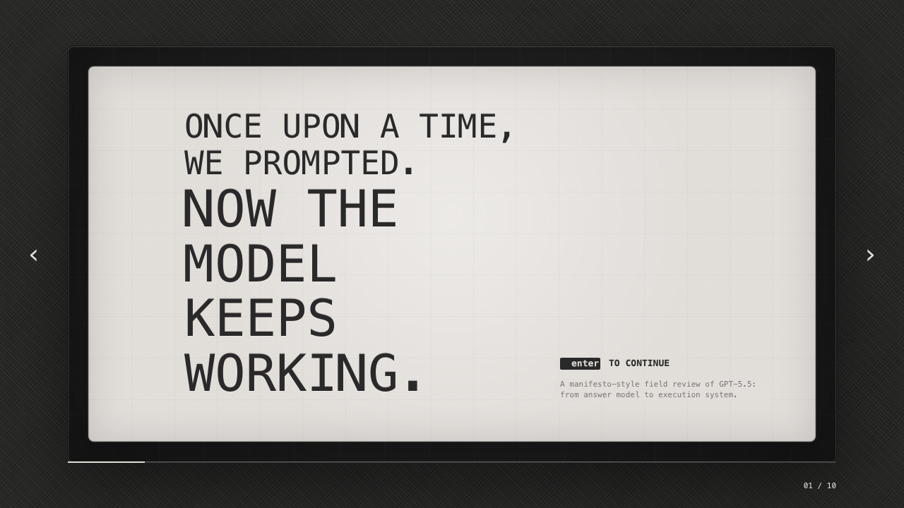<br><strong>Geek Report</strong><br>Geek energy, terminal paper, technical point-of-view.</td>
    <td width="50%">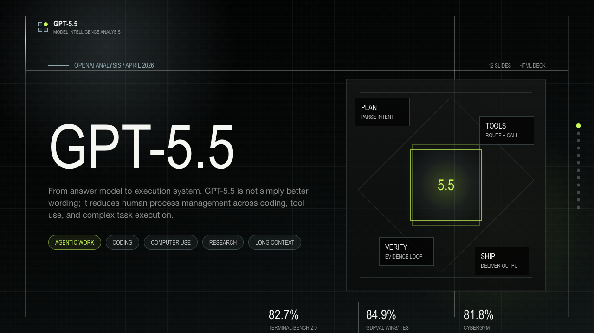<br><strong>Pixel Report</strong><br>Dark grids, pixel HUDs, and technical metric breakdowns.</td>
  </tr>
  <tr>
    <td width="50%">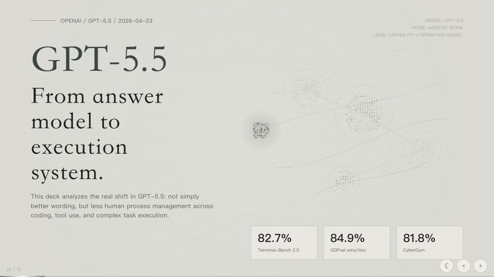<br><strong>Dot Matrix</strong><br>Dot-matrix fields, dark/light variants, signal narratives.</td>
    <td width="50%">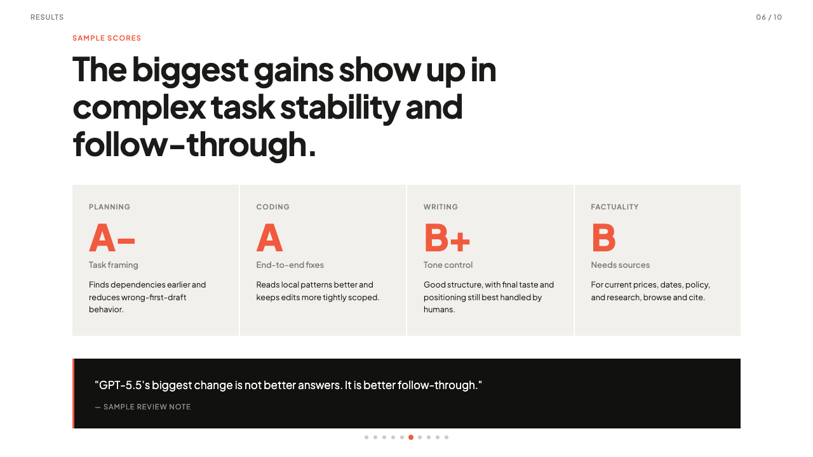<br><strong>Clean Review</strong><br>Minimal, clear contrast, serious analysis.</td>
  </tr>
  <tr>
    <td width="50%"><br><strong>Shiny Tiles</strong><br>Black grids, silver glass cards, and cold technical light.</td>
    <td width="50%"></td>
  </tr>
</table>

### Premium / Editorial

<table>
  <tr>
    <td width="50%">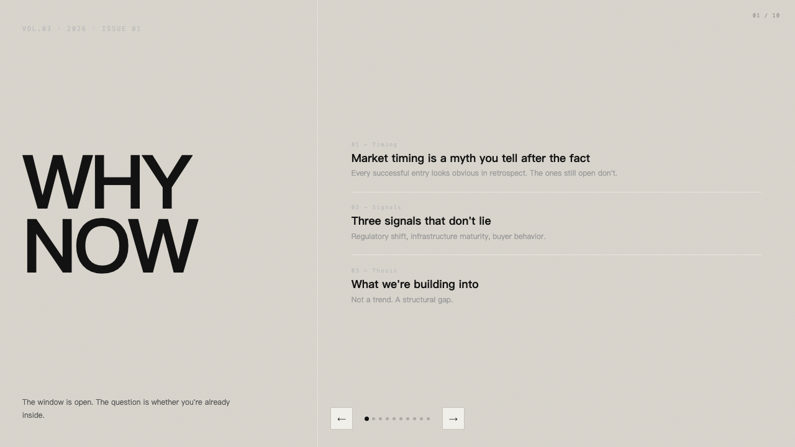<br><strong>Editorial</strong><br>Magazine-like essay structure with refined white space.</td>
    <td width="50%">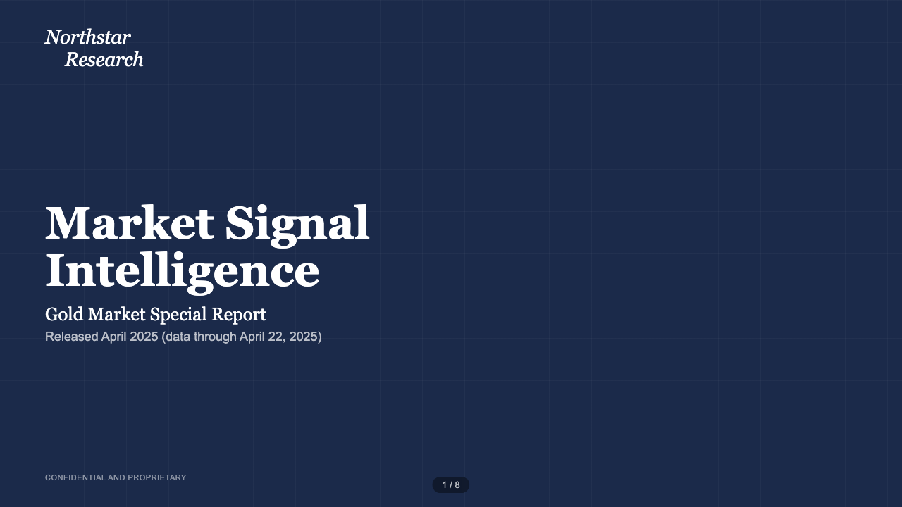<br><strong>Consulting Report</strong><br>Chart-heavy market and industry research with high-trust structure.</td>
  </tr>
  <tr>
    <td width="50%">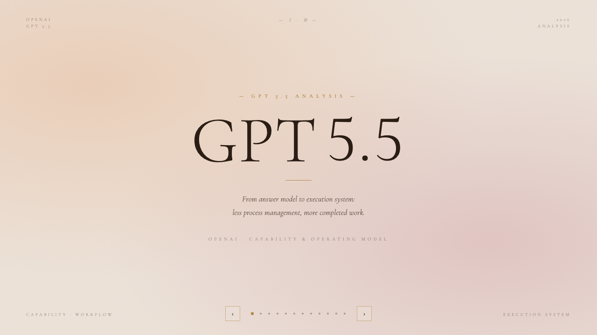<br><strong>Sunrise</strong><br>Warm whitespace, elegant titles, and premium narrative pacing.</td>
    <td width="50%">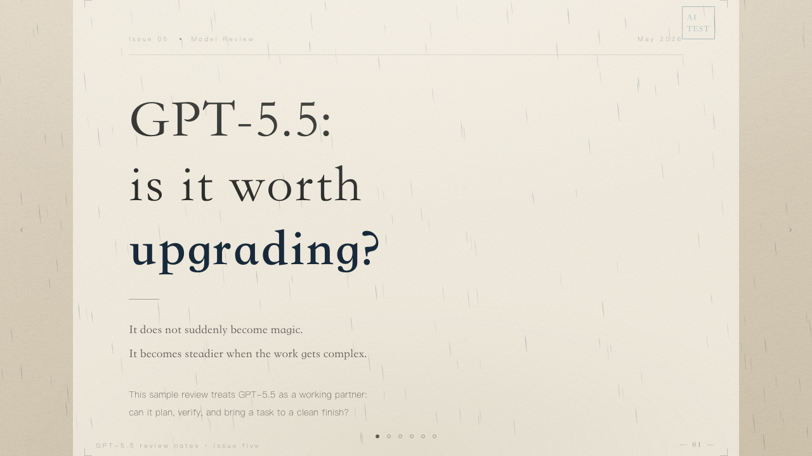<br><strong>Rain Notes</strong><br>Soft paper and quiet motion for review notes.</td>
  </tr>
  <tr>
    <td width="50%">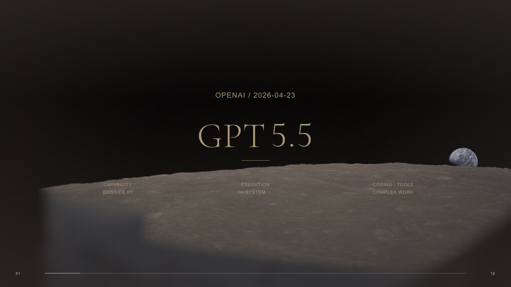<br><strong>Story Field</strong><br>Documentary imagery, archive mood, and cinematic horizontal narrative.</td>
    <td width="50%"></td>
  </tr>
</table>

### Expressive / Creator

<table>
  <tr>
    <td width="50%">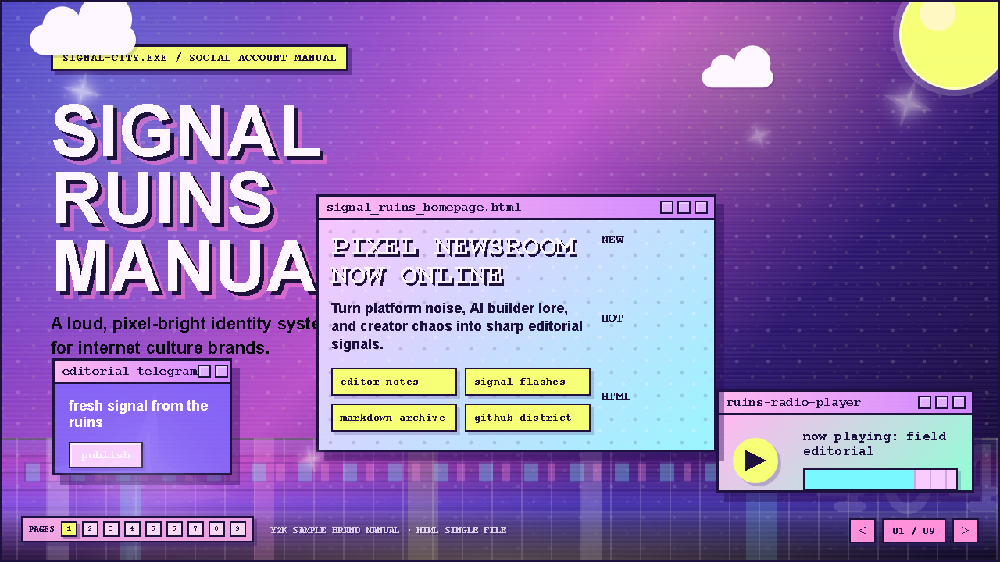<br><strong>Y2K Brand Manual</strong><br>Millennium web, chrome type, sparkles, pixel windows.</td>
    <td width="50%">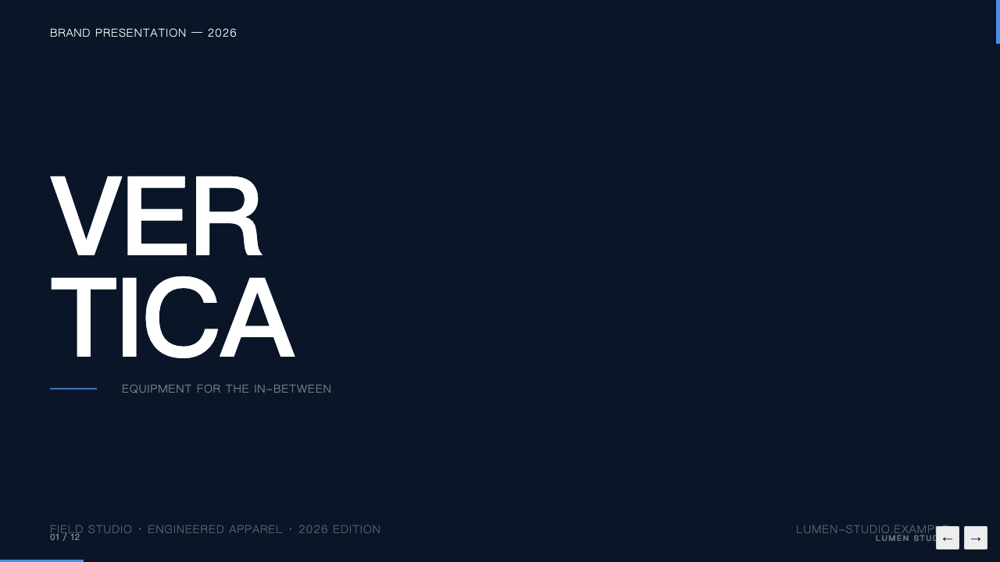<br><strong>Studio Photo</strong><br>Object-led portfolio system for photography and product work.</td>
  </tr>
</table>

## Xiaohongshu Cover Templates

Xiaohongshu cover templates are first-image cards, not longform reading cards. Eight common directions are shown here, with default `1200×1600` PNG export.

<table>
  <tr>
    <td width="25%"><br><strong>Editorial</strong></td>
    <td width="25%"><br><strong>Geek Report</strong></td>
    <td width="25%"><br><strong>Consulting</strong></td>
    <td width="25%"><br><strong>Sunrise</strong></td>
  </tr>
  <tr>
    <td width="25%"><br><strong>Clean Review</strong></td>
    <td width="25%"><br><strong>Rain Notes</strong></td>
    <td width="25%"><br><strong>Pixel Report</strong></td>
    <td width="25%"><br><strong>Shiny Tiles</strong></td>
  </tr>
</table>

## Xiaohongshu Longform Templates

Xiaohongshu templates turn a visual style into a continuous article card. Eight common directions are shown here, with default `1200×2000` PNG export.

<table>
  <tr>
    <td width="25%"><br><strong>Editorial</strong></td>
    <td width="25%"><br><strong>Geek Report</strong></td>
    <td width="25%"><br><strong>Consulting</strong></td>
    <td width="25%"><br><strong>Sunrise</strong></td>
  </tr>
  <tr>
    <td width="25%"><br><strong>Clean Review</strong></td>
    <td width="25%"><br><strong>Rain Notes</strong></td>
    <td width="25%"><br><strong>Pixel Report</strong></td>
    <td width="25%"><br><strong>Shiny Tiles</strong></td>
  </tr>
</table>

## Skill Structure

| Skill | Purpose |
|------|---------|
| `lieflat-html-design` | Router: choose deck, longform card, or cover card |
| `lieflat-html-deck` | Horizontal HTML presentations with 12 deck style families |
| `lieflat-xhs-longform` | Xiaohongshu longform vertical cards with 11 longform styles |
| `lieflat-xhs-cover` | Xiaohongshu first-image cover cards with 11 cover styles |

## Use Cases And Recommended Templates

| Use case | Recommended templates | Why |
|----------|-----------------------|-----|
| Chart-heavy market research, industry analysis, investor narrative | `consulting-report`, `clean-review` | High-trust structure for data-backed arguments and decision material |
| AI systems, model briefings, technical trend analysis | `dot-matrix`, `geek-report`, `pixel-report` | Strong technical language for metrics, flows, and systems thinking |
| Product reviews, competitive analysis, tool notes | `clean-review`, `rain-notes`, `geek-report` | Good for pros/cons, experience notes, and restrained evaluation |
| Creator brands, social accounts, internet culture | `y2k-brand`, `editorial` | More personality for identity systems, content packaging, and community-facing work |
| Brand campaigns, lifestyle, premium events | `sunrise`, `editorial` | Warmer atmosphere for premium storytelling and light commercial pitches |
| Photography portfolios, product visuals, client cases | `studio-photo`, `story-field` | Image-led structures for approved visual assets and project stories |
| Project recaps, field reports, people/place stories | `story-field`, `editorial` | Stronger narrative pacing for long-form visual storytelling |

When unsure, ask the agent to use `lieflat-html-design`. If you already know the delivery surface, name `lieflat-html-deck`, `lieflat-xhs-longform`, or `lieflat-xhs-cover` directly.

## Install

### Painless Install

The easiest path: give this repository link to Codex, Claude Code, Moxt, or another local agent and ask it to install the skills for you.

```text
Install Lieflat HTML Design for me:
https://github.com/larashero3-dotcom/lieflat-html-design

Please install the 4 skills from this repository into my user-level skills directory, then verify these files exist:
- lieflat-html-design/SKILL.md
- lieflat-html-deck/SKILL.md
- lieflat-xhs-longform/SKILL.md
- lieflat-xhs-cover/SKILL.md
```

If you already installed it, ask your agent to update it:

```text
Update Lieflat HTML Design for me:
https://github.com/larashero3-dotcom/lieflat-html-design

Please run git pull in the local install directory, or copy the latest 4 skills again, then tell me the current commit.
```

### Manual Install

If you prefer manual setup, clone once and copy all 4 skills.

Codex user-level install:

```bash
git clone https://github.com/larashero3-dotcom/lieflat-html-design
cd lieflat-html-design
mkdir -p ~/.codex/skills
cp -R skills/lieflat-html-design skills/lieflat-html-deck skills/lieflat-xhs-longform skills/lieflat-xhs-cover ~/.codex/skills/
```

Codex project-level install:

```bash
mkdir -p .agents/skills
cp -R skills/lieflat-html-design skills/lieflat-html-deck skills/lieflat-xhs-longform skills/lieflat-xhs-cover .agents/skills/
```

Claude Code user-level install:

```bash
mkdir -p ~/.claude/skills
cp -R skills/lieflat-html-design skills/lieflat-html-deck skills/lieflat-xhs-longform skills/lieflat-xhs-cover ~/.claude/skills/
```

Claude Code project-level install:

```bash
mkdir -p .claude/skills
cp -R skills/lieflat-html-design skills/lieflat-html-deck skills/lieflat-xhs-longform skills/lieflat-xhs-cover .claude/skills/
```

## Usage

After installation, this skill collection can also be used in Moxt.ai and other agent workspaces that can read project files or custom skills.

Ask your agent:

```txt
Use lieflat-html-deck to create a company-facing strategy deck in Chinese.
```

```txt
Use lieflat-html-deck to make a creator brand manual. Pick the best visual style from the catalog.
```

```txt
Use lieflat-html-deck to create a photo-led product portfolio deck. I will provide approved images.
```

```txt
Use lieflat-xhs-longform to create a Xiaohongshu longform card in Sunrise style for an AI product review.
```

```txt
Use lieflat-xhs-cover to create a Xiaohongshu cover in Dot Matrix style for an AI systems observation post.
```

If the delivery surface is unclear, use the router:

```txt
Use lieflat-html-design to turn this content into the right HTML visual artifact.
```

The agent should route to the target skill, read that skill's `assets/catalog.json` and `references/style-understanding.md`, choose a template, copy it to the target project, replace the content, adjust the layout, and run screenshot QA.

## Specify A Style

If you already know the visual direction, name the style directly:

```text
Use dot-matrix for a technical analysis deck.
Use consulting-report for a chart-heavy AI Agent industry report.
Use story-field for an image-led project recap.
```

Available presentation styles: Y2K Brand Manual, Shiny Tiles, Studio Photo, Geek Report, Pixel Report, Dot Matrix, Clean Review, Editorial, Consulting Report, Sunrise, Rain Notes, and Story Field.

Use Consulting Report only when the deck has substantial charts, tables, metrics, market or industry evidence, competitor comparisons, or investor/business analysis. For text-heavy strategy essays, opinion decks, teaching material, or internal memos with few data exhibits, prefer Editorial, Clean Review, Geek Report, Rain Notes, or Sunrise.

Xiaohongshu longform styles: Rain Notes, Editorial, Geek Report, Terminal, Dot Matrix Light, Clean Review, Pixel Report, Story Field, Shiny Tiles, Sunrise, and Consulting Report.

Xiaohongshu cover styles: Clean Review, Editorial, Dot Matrix, Consulting Report, Rain Notes, Pixel Report, Sunrise, Geek Report, Terminal, Story Field, and Shiny Tiles.

For script usage, check the target skill's `assets/catalog.json` for exact template IDs.

## Local Scripts

Run scripts from the target skill folder:

```bash
# Horizontal HTML decks
cd skills/lieflat-html-deck
node scripts/list-templates.mjs
node scripts/audit-languages.mjs
node scripts/capture-template-previews.mjs --lang en --out ../../previews/en
node scripts/capture-template-previews.mjs --lang zh --out ../../previews/zh
node scripts/create-design.mjs --template editorial --lang zh --out output/editorial-demo.html
node scripts/audit-assets.mjs output/editorial-demo.html
node scripts/capture-screenshots.mjs --url http://localhost:8765/output/editorial-demo.html --count 8 --out screenshots

# Xiaohongshu longform
cd ../lieflat-xhs-longform
node scripts/create-design.mjs --template xhs-sunrise --lang zh --out output/xhs-demo.html
node scripts/capture-xhs-card.mjs --html output/xhs-demo.html --out output/xhs-demo-card.png

# Xiaohongshu cover
cd ../lieflat-xhs-cover
node scripts/create-design.mjs --template xhs-cover-dot-matrix --lang zh --out output/xhs-cover-demo.html
node scripts/capture-xhs-card.mjs --html output/xhs-cover-demo.html --out output/xhs-cover-demo.png
```

Use strict bilingual audit when every `lieflat-html-deck` presentation template must include both `en` and `zh`:

```bash
node scripts/audit-languages.mjs --strict-bilingual
```

From the repository root:

```bash
npm run list
npm run audit:languages
npm run preview:capture
npm run preview:capture:longform
npm run preview:capture:cover
```

## License

MIT.
